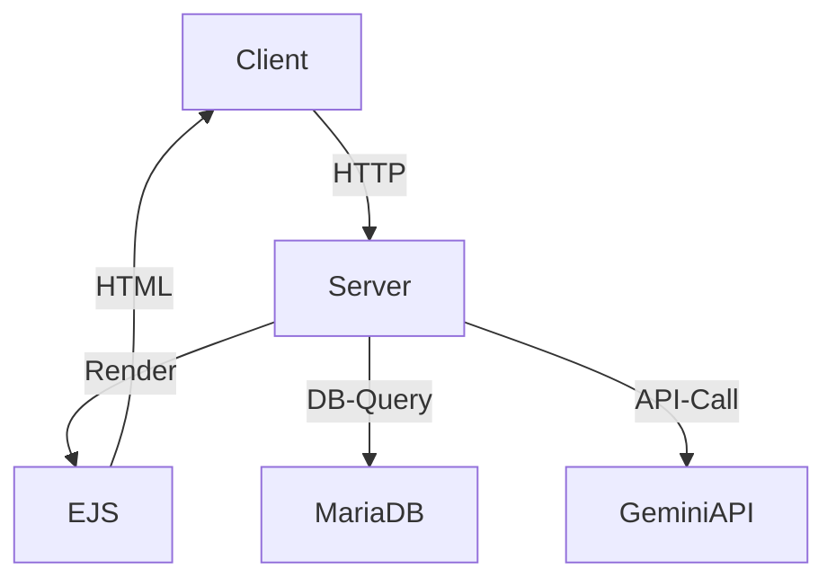
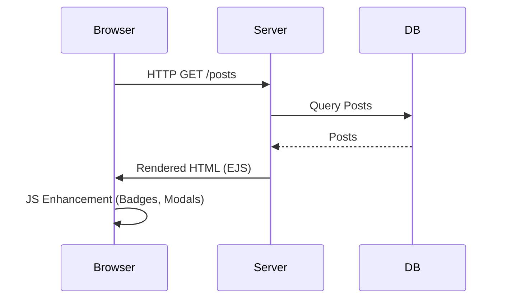
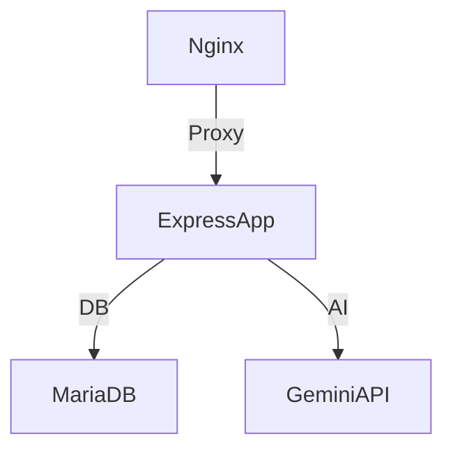
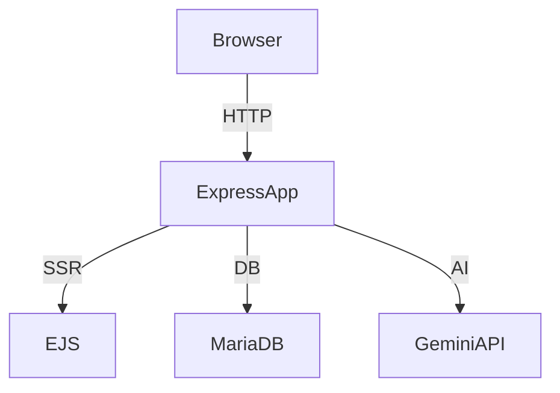
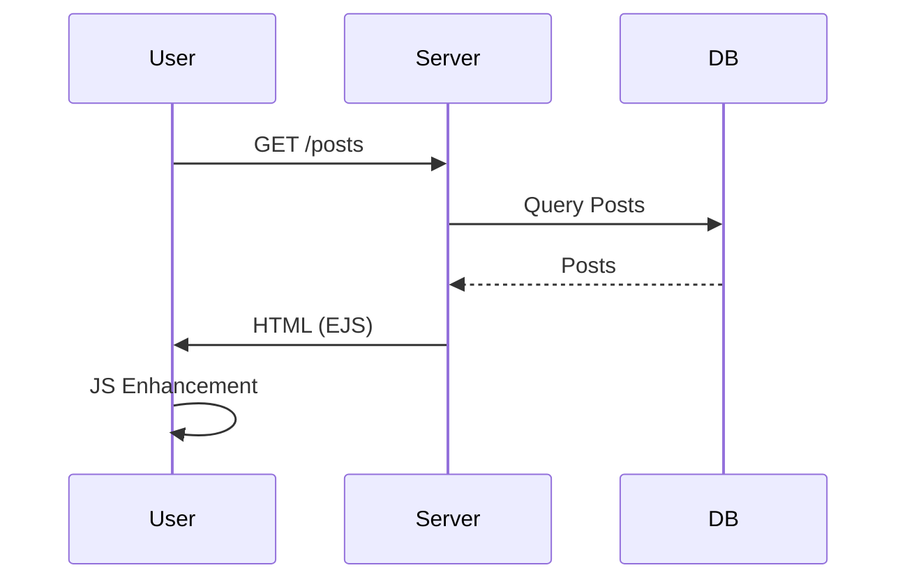

# Sub species aeternitatis
### A blog about philosophy, AI and science
<hr>

## Description

This is the second version of my blog. It's hosted on an Ubuntu VPS and using Plesk as Webhosting-Control-Panel.
I reworked the whole backend and changed the whole structure.
Added MVC design-pattern, security middleware, express routes, jest tests, docker containerization, ESlint, ejs templates and extended backend logging.

# ExpressBlog – Vollständige Projektdokumentation

---

## Inhaltsverzeichnis
1. [Projektüberblick](#projektüberblick)
2. [Architektur & Patterns](#architektur--patterns)
3. [Backend](#backend)
4. [Frontend](#frontend)
5. [Validierung & Fehlerbehandlung](#validierung--fehlerbehandlung)
6. [Rendering & SSR/CSR](#rendering--ssrcsr)
7. [AI-Integration](#ai-integration)
8. [Testing & Qualitätssicherung](#testing--qualitätssicherung)
9. [Deployment & Betrieb](#deployment--betrieb)
10. [Erweiterbarkeit & Best Practices](#erweiterbarkeit--best-practices)
11. [Einstieg & Anleitung](#einstieg--anleitung)
12. [Diagramme](#diagramme)

---

## 1. Projektüberblick

**Technologie-Stack:**
- **Backend:** Node.js, Express.js, MariaDB
- **Frontend:** EJS (Server-Side Rendering), Vanilla JS (ESM), TinyMCE, Bootstrap, Custom CSS
- **Testing:** Jest
- **Deployment:** Docker, docker-compose

---

## 2. Architektur & Patterns

### Layered/MVC-Architektur
Das Projekt folgt dem Model-View-Controller-Prinzip (MVC):
- **Model:** Datenmodelle und DB-Zugriff (z.B. `models/postModel.js`)
- **View:** EJS-Templates für SSR, Client-Side Enhancement via JS
- **Controller:** Request-Handling, Validierung, Response-Logik (z.B. `controllers/postController.js`)

### Modularisierung
- **Express Router:** Trennung nach Feature (z.B. `postRoutes.js`, `authRoutes.js`)
- **Frontend-Module:** ESM-Module für Utilities, Editor, AI, etc.
- **Utility-Pattern:** Gemeinsame Funktionen in `utils/` und `common.js`

### RESTful Routing
- Klare Trennung von Ressourcen und HTTP-Methoden (z.B. `GET /blogpost/:id`, `POST /blogpost/create`)

### Beispiel: Architekturdiagramm


---

## 3. Backend

### Server-Setup
- Einstiegspunkt: `server.js`/`app.js`
- Express-App mit Middlewares (Logger, Security, Auth, Validation)

### Routing
- Modular per Feature (z.B. `/blogpost`, `/auth`, `/ai`)
- Beispiel:
```js
const postRouter = require('./routes/postRoutes');
app.use('/blogpost', postRouter);
```

### Controller
- Verantwortlich für Request-Handling, Validierung, Response
- Beispiel:
```js
// controllers/postController.js
exports.createPost = async (req, res) => {
  // Validierung, DB-Insert, Response
};
```

### Model
- Datenmodelle (z.B. `models/postModel.js`)
- Direkter DB-Zugriff oder via ORM/Query-Builder

### Middleware
- Authentifizierung (JWT, Session)
- Autorisierung (Admin-Check)
- Logging (Request/Response, Fehler)
- Security (CORS, CSP, Input-Sanitization)
- Validierung (z.B. express-validator)

### Sicherheit
- Passwort-Hashing (bcrypt)
- CSRF-Schutz, XSS-Schutz (DOMPurify, CSP)
- Rate Limiting, Error Handling

---

## 4. Frontend

### Templating
- EJS (Embedded JavaScript Templates)
- Dynamische Einbindung von Daten, Loops, Conditionals
- Partials (Navbar, Footer, Messages)

### Client-Side JS
- Modularer Aufbau (`common.js`, `ai-assistant.js`, `tinymce-editor.js`)
- Dynamische UI-Interaktionen (Modals, Notifications, Badges)
- SSR/CSR-Hybrid: Server-Rendering + Client-Enhancements

### Editor
- TinyMCE 6.x Integration
- Custom Toolbars, AI-Integration, Light/Dark-Mode Handling

### Styling
- CSS (Custom, Bootstrap, Theme-Varianten)
- Dark/Light-Mode via CSS-Variablen und Data-Attribute
- Responsive Design (Bootstrap Grid)

### Notifications & Modals
- Custom Notification-System (Stacking, Styling)
- Einheitliche Modals für Alerts, Setups, etc.

---

## 5. Validierung & Fehlerbehandlung

### Backend
- Input-Validierung (Middleware, Model-Checks)
- Fehlerobjekte, Exception-Handling, Logging

### Frontend
- Form-Validierung, User-Feedback, Notification-System

---

## 6. Rendering & SSR/CSR

### Server-Side Rendering (SSR)
- EJS-Templates für initiale Auslieferung
- Inline Critical CSS zur FOUC-Vermeidung

### Client-Side Enhancement (CSR)
- Nachträgliche Anreicherung (Badges, Modals, Interaktivität)
- Utility-Module für DOM-Manipulation

### SSR/CSR-Flow-Diagramm


---

## 7. AI-Integration

### Architektur
- Google Gemini API via Server-Proxy
- Textverbesserung, Tag-Generierung, Zusammenfassungen
- API-Key-Setup via Modal

### Beispiel: AI-Request
```js
// ai-assistant.js
async function improveText(text) {
  const resp = await fetch('/ai/improve', { method: 'POST', body: JSON.stringify({ text }) });
  return await resp.json();
}
```

---

## 8. Testing & Qualitätssicherung

### Unit- und Integrationstests
- Jest für Backend und Frontend-Logik
- Testabdeckung für Controller, Utilities, Freshness-Logik

### Beispiel: Testfall
```js
import { classifyPostFreshness } from '../public/assets/js/utils/postFreshness.js';
test('classifies very new', () => {
  const now = new Date();
  expect(classifyPostFreshness(now).isVeryNew).toBe(true);
});
```

---

## 9. Deployment & Betrieb

### Docker
- Dockerfile, docker-compose für lokale Entwicklung und Deployment

### Logging
- Logfiles (Access, Error, Debug, Auth)

### Konfiguration
- `.env`-Dateien, Config-Module

### Deployment-Stack-Diagramm


---

## 10. Erweiterbarkeit & Best Practices

### Modularisierung
- Klare Trennung von Concerns
- Utility- und Helper-Module

### Security by Design
- Minimale Angriffsfläche, Defense-in-Depth

### Performance
- Caching, Lazy Loading, Critical CSS

---

## 11. Einstieg & Anleitung

### Setup
- Voraussetzungen: Node.js, npm, MariaDB, Docker (optional)
- Installation:
```sh
git clone <repo-url>
cd ExpressBlog
npm install
```
- Starten:
```sh
npm run dev
# oder mit Docker:
docker-compose up --build
```

### Entwicklung
- Struktur der wichtigsten Verzeichnisse:
  - `controllers/`, `models/`, `routes/`, `middleware/`, `views/`, `public/assets/js/`
- Neue Features: Im passenden Modul ergänzen, Tests schreiben
- Debugging: Logging, Jest-Tests

---

## 12. Diagramme

### Architekturübersicht


### SSR/CSR-Interaction


---
