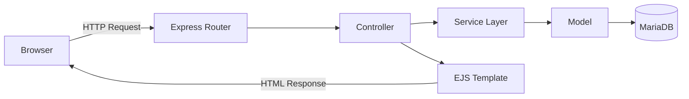
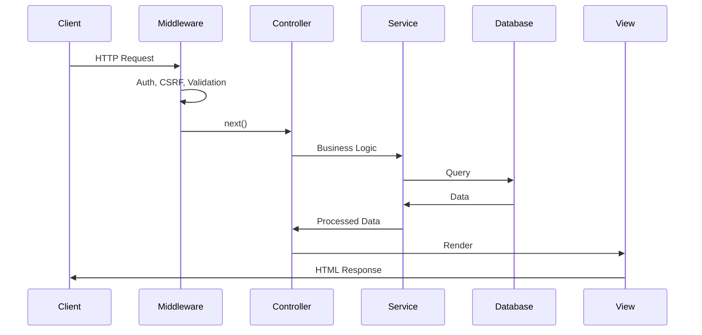

# ExpressBlog

> Modern full-stack blog platform built with Node.js, Express 5, and MariaDB

[](https://nodejs.org/)
[](LICENSE)

A professional blogging platform featuring AI-powered content assistance, comprehensive security, and modern DevOps practices. Built for philosophical and scientific discourse.

---

## Features

### Core Functionality
- **Blog Management** – Create, edit, and organize posts with categories and tags
- **Rich Text Editor** – TinyMCE integration with custom toolbars and AI assistance
- **Comments System** – Unmoderated, anonymous commenting with spam protection
- **Media Management** – Image upload with optimization and sanitization
- **Advanced Search** – Full-text search across posts with category filtering
- **Sitemap & SEO** – Auto-generated sitemaps and robots.txt

### AI Integration
- **Google Gemini API** – Text improvement, summarization, and tag generation
- **Content Enhancement** – AI-powered suggestions for better writing
- **Smart Tagging** – Automatic tag recommendations based on content

### Security & Authentication
- **JWT Authentication** – Secure admin access with HTTP-only cookies
- **CSRF Protection** – Token-based cross-site request forgery prevention
- **Rate Limiting** – Configurable limits for login, API, and global requests
- **Input Validation** – Celebrate/Joi schema validation on all endpoints
- **XSS Protection** – DOMPurify sanitization, CSP headers via Helmet
- **SQL Injection Prevention** – Parameterized queries via Knex

### Architecture & Quality
- **MVC Pattern** – Clean separation of concerns (Models, Views, Controllers)
- **RESTful API** – Well-structured routes with clear HTTP semantics
- **Database Migrations** – Version-controlled schema changes with Knex
- **Comprehensive Testing** – Jest unit and integration tests (80%+ coverage)
- **Code Quality** – ESLint with custom rules for security patterns
- **Logging** – Structured logging with rotation and audit trails

### DevOps & Deployment
- **Docker Development** – Complete local environment with hot-reload
- **CI/CD Pipeline** – GitHub Actions for automated testing and deployment
- **Production PM2** – Process management with automatic restarts
- **Environment Management** – Separate configs for dev/staging/production

---

## Technology Stack

### Backend
- **Runtime:** Node.js 22.x (ESM modules)
- **Framework:** Express 5.x
- **Database:** MariaDB 10.11+ with Knex.js ORM
- **Authentication:** JWT (jsonwebtoken) + bcrypt password hashing
- **Validation:** Celebrate (Joi-based) + express-validator
- **File Upload:** Multer with sanitization and type checking
- **Security:** Helmet, CSRF (@dr.pogodin/csurf), Rate Limiting

### Frontend
- **Templating:** EJS (Server-Side Rendering)
- **JavaScript:** ES Modules (Vanilla JS, no framework)
- **Editor:** TinyMCE 6.x
- **Styling:** Bootstrap 5 + Custom CSS (Light/Dark themes)
- **Sanitization:** DOMPurify (client-side XSS prevention)

### AI & Third-Party Services
- **AI Provider:** Google Gemini API (@google/generative-ai)
- **Editor API:** TinyMCE Cloud

### Development & Testing
- **Testing:** Jest 30.x (with jsdom for DOM testing)
- **Linting:** ESLint 10.x with custom security rules
- **Environment:** Docker Compose (MariaDB + Node.js)
- **Process Manager:** Nodemon (dev) / PM2 (production)

### DevOps
- **Containerization:** Docker + Docker Compose
- **CI/CD:** GitHub Actions
- **Deployment:** SSH-based deployment to Ubuntu VPS
- **Web Server:** nginx (reverse proxy on production)

---

## Quick Start

### Prerequisites

- **Docker** & **Docker Compose** installed
- **Node.js 22+** (if running without Docker)
- **Git**

### Local Development with Docker

```bash
# 1. Clone repository
git clone https://github.com/OneMillionthUsername/ExpressBlog.git
cd ExpressBlog

# 2. Environment setup (check .env.development exists)
# Already configured with sensible defaults for Docker

# 3. Start containers
docker compose up -d

# 4. Run migrations
docker compose exec app npm run migrate

# 5. (Optional) Import database backup
docker compose cp db_backup/backup.sql db:/tmp/backup.sql
docker compose exec db sh -c 'mariadb -uroot -pdev_password your_database_name < /tmp/backup.sql'

# 6. Access application
# → http://localhost:3000
```

**Available Services:**
- **App:** http://localhost:3000
- **Database:** localhost:3307 (root/dev_password)

### Development without Docker

```bash
# 1. Install dependencies
npm install

# 2. Setup environment
cp .env.example .env
# Edit .env with your database credentials

# 3. Setup database
# Create MariaDB database: your_database_name (utf8mb4)

# 4. Run migrations
npm run migrate

# 5. Start development server
npm run dev  # Uses nodemon with hot-reload
```

---

## 📖 Documentation

For detailed documentation, see:

- **[DEVELOPMENT.md](DEVELOPMENT.md)** – Complete development guide
  - Docker setup and commands
  - CI/CD pipeline configuration
  - Git workflow and branch strategy
  - Database management and migrations
  - Deployment processes
  - Troubleshooting guide

---

## Available Scripts

### Development
```bash
npm run dev          # Start with nodemon (hot-reload)
npm start            # Start production server
```

### Testing
```bash
npm test             # Run all tests
npm run test:watch   # Watch mode for TDD
npm run test:coverage # Generate coverage report
npm run test:ci      # CI-optimized test run
```

### Code Quality
```bash
npm run lint         # Check code style
npm run lint:fix     # Auto-fix issues
```

### Database
```bash
npm run migrate              # Run pending migrations
npm run migrate:rollback     # Rollback last migration
npm run sanitize-db          # Clean HTML in posts (production)
npm run sanitize-db:dry      # Preview sanitization changes
```

### Utilities
```bash
npm run copy:dompurify       # Copy DOMPurify to public folder
node scripts/hash-password.js      # Generate bcrypt password hash
node scripts/generate-jwt-secret.js # Generate secure JWT secret
```

---

## Security Features

### Authentication & Authorization
- JWT tokens with configurable expiration (24h default)
- HTTP-only cookies for token storage (XSS mitigation)
- Bcrypt password hashing (10 rounds)
- Failed login tracking and account locking
- Role-based access control (admin/editor/viewer)

### Request Protection
- **CSRF Tokens** – Required for state-changing operations
- **Rate Limiting** – Global, strict, and login-specific limiters
- **Input Validation** – Schema validation on all endpoints
- **Content Security Policy** – Via Helmet middleware
- **X-Frame-Options** – Clickjacking prevention

### Data Protection
- **SQL Injection** – Parameterized queries via Knex
- **XSS Prevention** – DOMPurify (client) + HTML escaping (server)
- **Path Traversal** – Sanitized filenames on upload
- **File Type Validation** – Magic number checking (not just extension)

### Additional Hardening
- Compression with default settings
- Cookie security flags (httpOnly, secure in prod, sameSite)
- Secrets management via environment variables
- Audit logging for authentication events

---

## Git Workflow

### Branch Strategy

```
main (Production)
  ↑ merge
develop (Development)
  ↑ merge
feature/* (Features)
```

### Branches

| Branch | Purpose | CI/CD |
|--------|---------|-------|
| `main` | Production-ready code | ✅ Tests + 🚀 Auto-deploy |
| `develop` | Integration branch | ✅ Tests only |
| `feature/*` | Feature development | Manual |

### Typical Workflow

```bash
# 1. Create feature branch
git checkout develop
git checkout -b feature/new-feature

# 2. Develop and commit
git add .
git commit -m "feat: Add new feature"

# 3. Push and test
git push origin feature/new-feature
# Create PR to develop → CI runs tests

# 4. Merge to develop
git checkout develop
git merge feature/new-feature
git push origin develop  # → Tests run

# 5. Release to production
git checkout main
git merge develop
git push origin main  # → Tests + Deployment
```

**Commit Message Convention:**
- `feat:` New features
- `fix:` Bug fixes
- `docs:` Documentation
- `refactor:` Code restructuring
- `test:` Test additions
- `chore:` Build/tooling changes

---

## Deployment

### Production Environment

- **Server:** Ubuntu 24.04 LTS VPS
- **Domain:** your-domain.com (YOUR_SERVER_IP)
- **Process Manager:** PM2 (app name: `your-app-name`)
- **Web Server:** nginx (reverse proxy to port 3000)
- **Path:** `/path/to/your/app`

### Automatic Deployment (Recommended)

Push to `main` branch triggers automatic deployment:

```bash
git push origin main
```

**What happens:**
1. GitHub Actions runs tests
2. If tests pass, SSH into VPS
3. Execute deployment script:
   - `git pull origin main`
   - `npm ci` (clean install)
   - `pm2 restart your-app-name`

### Manual Deployment

```bash
# SSH into server
ssh your-user@YOUR_SERVER_IP

# Navigate to project
cd /path/to/your/app

# Run deployment script
bash scripts/deploy-production.sh
```

### GitHub Secrets Configuration

Required secrets in repository settings:

| Secret | Value |
|--------|-------|
| `SERVER_IP` | Your server IP address |
| `SERVER_USER` | Your SSH username (e.g., root, ubuntu) |
| `SSH_PRIVATE_KEY` | Your private SSH key content |

Configure at: `https://github.com/YOUR_USERNAME/YOUR_REPO/settings/secrets/actions`

---

## Project Structure

```
ExpressBlog/
├── 📂 .github/workflows/    # CI/CD pipelines
│   ├── test.yml             # Test workflow (develop + main)
│   └── deploy-production.yml # Deployment workflow (main only)
├── 📂 config/               # Configuration files
│   ├── config.js            # Environment variables
│   └── dbConfig.js          # Database connection
├── 📂 controllers/          # Request handlers (MVC)
│   ├── postController.js
│   ├── commentController.js
│   ├── adminController.js
│   └── ...
├── 📂 models/               # Data models & validation
│   ├── postModel.js
│   ├── adminModel.js
│   └── customExceptions.js
├── 📂 routes/               # Express routers
│   ├── postRoutes.js
│   ├── authRoutes.js
│   ├── aiRoutes.js
│   └── routesExport.js      # Centralized route registration
├── 📂 middleware/           # Express middleware
│   ├── authMiddleware.js    # JWT authentication
│   ├── securityMiddleware.js # CSRF, validation
│   ├── loggerMiddleware.js  # Request logging
│   └── databaseMiddleware.js # DB health checks
├── 📂 services/             # Business logic
│   ├── authService.js       # Token generation, verification
│   └── validationService.js # Input validation helpers
├── 📂 views/                # EJS templates
│   ├── layout.ejs           # Main layout
│   ├── index.ejs            # Homepage
│   ├── createPost.ejs       # Post editor
│   ├── readPost.ejs         # Post detail view
│   └── partials/            # Reusable components
├── 📂 public/               # Static assets
│   ├── assets/
│   │   ├── js/              # Client-side ESM modules
│   │   │   ├── common.js
│   │   │   ├── admin.js
│   │   │   ├── ai-assistant/
│   │   │   └── tinymce/
│   │   └── css/             # Stylesheets (themes)
│   └── vendor/              # Third-party libraries
├── 📂 tests/                # Jest test suite
│   ├── *.test.js            # Unit tests
│   ├── *.integration.test.js # Integration tests
│   └── setup.js             # Test configuration
├── 📂 migrations/           # Knex database migrations
├── 📂 scripts/              # Utility scripts
│   ├── deploy-production.sh
│   ├── hash-password.js
│   └── sanitize-db-posts.js
├── 📂 databases/            # Database connection layer
├── 📂 utils/                # Utility functions
│   ├── csrf.js              # CSRF middleware
│   ├── limiters.js          # Rate limiting configs
│   └── logger.js            # Winston logger
├── 📄 app.js                # Express app setup
├── 📄 server.js             # HTTP server startup
├── 📄 knexfile.js           # Knex configuration
├── 📄 jest.config.js        # Jest configuration
├── 📄 eslint.config.js      # ESLint configuration
├── 📄 docker-compose.yml    # Docker services
├── 📄 Dockerfile            # Node.js container
├── 📄 .env.development      # Local environment
└── 📄 package.json          # Dependencies & scripts
```

---

## Testing

### Test Coverage

- **Unit Tests** – Controllers, models, services, utilities
- **Integration Tests** – API endpoints, authentication flows
- **DOM Tests** – Client-side JavaScript (jsdom)
- **Security Tests** – CSRF, authentication, authorization

### Running Tests

```bash
# All tests
npm test

# Watch mode (TDD)
npm run test:watch

# Coverage report
npm run test:coverage
# → Open coverage/lcov-report/index.html

# CI mode (no watch, coverage)
npm run test:ci
```

### Example Test

```javascript
describe('POST /blogpost/create', () => {
  it('requires authentication', async () => {
    const res = await request(app)
      .post('/blogpost/create')
      .send({ title: 'Test' });
    
    expect(res.status).toBe(401);
    expect(res.body.error).toBe('Access denied');
  });
});
```

---

## Architecture

### MVC Pattern



### Request Flow



---

## Contributing

Contributions are welcome! Please follow these guidelines:

1. **Fork** the repository
2. Create a **feature branch** from `develop`
3. **Write tests** for new functionality
4. Ensure **linter passes** (`npm run lint`)
5. **Commit** with conventional messages
6. **Open a Pull Request** to `develop`

### Development Tips

- Run tests before committing: `npm test`
- Use feature flags for experimental features
- Document breaking changes in PR description
- Keep commits atomic and well-described

---

## License

ISC License - see [LICENSE](LICENSE) file for details

---

## Acknowledgments

- **Express.js** – Fast, unopinionated web framework
- **TinyMCE** – Powerful rich text editor
- **Google Gemini** – AI content assistance
- **Jest** – Delightful testing framework
- **Docker** – Containerization platform

---

## Contact

- **Website:** [your-website.com](https://your-website.com)
- **GitHub:** [@your-username](https://github.com/your-username)

---

**Built with love for philosophical discourse and technical excellence**
