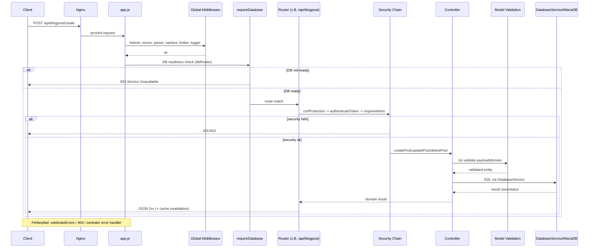

# ExpressBlog

Moderne Blog-Plattform auf Basis von Node.js, Express 5 und MariaDB mit SSR (EJS), Admin-Authentifizierung, CSRF-Schutz, Rate-Limiting und Docker-Setup.

## Status

- **Repository:** ExpressBlog
- **Node.js:** empfohlen 22.x (laut Docker/CI), mindestens `>=20` (laut `package.json`)
- **Runtime:** ESM (`"type": "module"`)
- **Datenbank:** MariaDB (über `mysql2` + Knex)
- **Aktualisiert:** März 2026

## Kernfunktionen

- Blogposts mit Slugs, Archiv, Kategorie-Filter und „Most Read“
- Kommentar-Funktion (SSR + API)
- Karten-/Info-Elemente (Cards) inkl. API und SSR-Routen
- Medien-Upload mit Multer + Dateityp-Prüfung
- Admin-Login über JWT (Cookie-basiert)
- AI-Endpoint für Textgenerierung (`/api/ai/generate`, admin-geschützt)
- Sitemap/Robots-Auslieferung

## Sicherheit

- `helmet` mit CSP
- CSRF-Schutz via `@dr.pogodin/csurf`
- Rate-Limits (global, strict, login)
- Input-Sanitizing/Escaping-Middleware
- `httpOnly` Auth-Cookies, `sameSite: strict`, `secure` in Production
- Validierung mit `celebrate`/`Joi`

## Projektstruktur (Auszug)

```text
config/         Laufzeit-Konfiguration
controllers/    Route-Handler
middleware/     Auth, Security, Logging, Upload
models/         Datenzugriff
routes/         SSR- und API-Router
services/       Business-Logik
utils/          Helper (Limiter, CSRF, Logger, ...)
migrations/     Knex-Migrationen
tests/          Unit/Integrationstests
integrationTests/
```

## Architektur & Request-Flow

### Komponentenübersicht

```mermaid
flowchart TD
  Client[Browser / API Client] --> Nginx[Nginx Reverse Proxy]
  Nginx --> Server[server.js]
  Server --> App[app.js]

  App --> MW[Globale Middleware\nhelmet, nonce, compression, cookieParser,\njson/urlencoded, sanitize, rate-limit, logger]
  App --> Public[Public Mounts\n/legalRoutes, sitemapRouter, express.static, /health]
  App --> EarlyApi[Early API Mounts\n/api/ai, /api utility, /debug/headers]

  App --> Init[initializeApp()\ninit DB, test conn, init schema]
  Init --> DB[(MariaDB Pool / Mock Pool)]
  Init -->|nach Ready| DbRouter[dbRouter via createDbRouter]

  DbRouter --> RequireDB[requireDatabase middleware]
  RequireDB --> SSR[SSR Router\nstaticRoutes, postRoutes, commentsRoutes, cardRoutes]
  RequireDB --> API[JSON API Router\npostApi, commentsApi, cardApi, auth]

  SSR --> C1[Controller Layer]
  API --> C1
  C1 --> M1[Model Validation (Joi classes)]
  C1 --> DS[DatabaseService in mariaDB.js]
  DS --> DB

  API --> Security[Route Security\ncsrfProtection, authenticateToken, requireAdmin]
  SSR --> Security

  App --> EH[Error Handling\ncelebrateErrors -> 404 -> error handler\n(API JSON / SSR render)]
```

### Typischer Request-Flow (geschützter Write)


```mermaid
sequenceDiagram
  participant C as Client
  participant N as Nginx
  participant A as app.js
  participant G as Global Middleware
  participant D as requireDatabase
  participant R as Router (z.B. /api/blogpost)
  participant S as Security Chain
  participant CT as Controller
  participant M as Model Validation
  participant DB as DatabaseService/MariaDB

  C->>N: POST /api/blogpost/create
  N->>A: proxied request
  A->>G: helmet, nonce, parser, sanitize, limiter, logger
  G-->>A: ok
  A->>D: DB readiness check (dbRouter)
  alt DB not ready
    D-->>C: 503 Service Unavailable
  else DB ready
    D->>R: route match
    R->>S: csrfProtection -> authenticateToken -> requireAdmin
    alt security fails
      S-->>C: 401/403
    else security ok
      S->>CT: createPost/updatePost/deletePost
      CT->>M: Joi validate payload/domain
      M-->>CT: validated entity
      CT->>DB: SQL via DatabaseService
      DB-->>CT: result rows/status
      CT-->>R: domain result
      R-->>C: JSON 2xx (+ cache invalidation)
    end
  end

  Note over A,C: Fehlerpfad: celebrateErrors / 404 / zentraler error handler
```

## Schnellstart

### Option A: Docker (empfohlen)

Voraussetzungen: Docker + Docker Compose

```bash
git clone https://github.com/OneMillionthUsername/ExpressBlog.git
cd ExpressBlog
docker compose up -d
docker compose exec app npm run migrate
```

Erreichbarkeit lokal:

- über Nginx-Dev-Container: `http://localhost:8080`
- direkt auf App-Port (localhost-only gebunden): `http://127.0.0.1:3000`

### Option B: Ohne Docker

Voraussetzungen: Node.js 22 (oder >=20), laufende MariaDB

```bash
npm install
cp .env.example .env.development
# .env.development anpassen (DB_*, JWT_SECRET, API-Keys)
npm run migrate
npm run dev
```

## Environment-Variablen

Wichtige Variablen (siehe `.env.example`):

- `NODE_ENV`, `PORT`, `HOST`, `DOMAIN`
- `LOG_LEVEL`, optional `LOG_DIR` (z. B. `/app/logs` im Container)
- `LOG_MODES` (CSV: `error,application,debug,auth,access`), optional `LOG_ACCESS_ENABLED`, `LOG_AUTH_ENABLED`
- Access-Logs in der App sind standardmäßig deaktiviert (Nginx übernimmt); nur bei Bedarf mit `LOG_ACCESS_ENABLED=true` aktivieren
- optional für Syslog-kompatible Auth-Audits: `SYSLOG_APP_NAME`, `SYSLOG_HOSTNAME`
- `DB_HOST`, `DB_PORT`, `DB_USER`, `DB_PASSWORD`, `DB_NAME`
- `JWT_SECRET`
- `GEMINI_API_KEY`, `TINY_MCE_API_KEY`
- optional: `JSON_BODY_LIMIT`, `URLENCODED_BODY_LIMIT`

## NPM-Skripte

### Entwicklung

- `npm run dev` – Start mit Nodemon
- `npm start` – Start mit Node (Production-like)

### Tests

- `npm test`
- `npm run test:watch`
- `npm run test:coverage`
- `npm run test:ci`
- `npm run test:quick`

### Qualität

- `npm run lint`
- `npm run lint:fix`
- `npm run lint:ci`

### Datenbank

- `npm run migrate`
- `npm run migrate:target`
- `npm run migrate:rollback`

### Utilities

- `npm run copy:dompurify`
- `npm run sanitize-db`
- `npm run sanitize-db:dry`
- `npm run sanitize-db:prod`
- `npm run sanitize-db:prod:dry`

## Route-Überblick

Wichtige Mountpoints (siehe `app.js` + `routes/dbRouter.js`):

- **Öffentlich / Core**
  - `GET /health`
  - `GET /` u. weitere SSR-Seiten über `routes/staticRoutes.js`
  - `GET /sitemap.xml`, `GET /robots.txt`
  - `GET /impressum`, `GET /datenschutz`

- **Auth**
  - `POST /auth/login`
  - `POST /auth/verify`
  - `POST /auth/logout`

- **Posts**
  - SSR: `/blogpost/...`
  - API: `/api/blogpost/...`

- **Kommentare**
  - SSR: `/comments/...`
  - API: `/api/comments/...`

- **Cards**
  - SSR: `/cards/...`
  - API: `/api/cards/...`

- **Uploads**
  - `POST /upload/image`

- **AI**
  - `POST /api/ai/generate` (CSRF + Auth + Admin erforderlich)

- **Utility API**
  - u. a. `GET /api/csrf-token`, `GET /api/health`

## Datenbank & Migrationen

- Knex-Konfiguration: `knexfile.js`
- Migrationen im Ordner `migrations/`
- DB-abhängige Routen werden erst nach erfolgreicher Initialisierung registriert

## Tests

Das Projekt enthält Unit- und Integrationstests in:

- `tests/`
- `integrationTests/`

Ausführen:

```bash
npm test
```

## CI/CD

Vorhandene Workflows:

- `.github/workflows/test.yml` – zentraler CI-Workflow (Lint + Tests + Coverage mit MariaDB-Service)
- `.github/workflows/deploy-production.yml` – Deployment-Workflow (läuft nach erfolgreichem CI auf `main` oder manuell per `workflow_dispatch`)

Die Pipeline ist damit konsolidiert: keine doppelten Testläufe in separaten Workflows mehr.

## Deployment

- Deployment-Skript: `scripts/deploy-production.sh`
- Docker-basierter Production-Flow ist in `deploy-production.yml` hinterlegt
- Production-Betrieb: Node.js + MariaDB in rootless Docker, nginx nativ auf dem Host

Weitere Details:

- `DEVELOPMENT.md`
- `DEPLOYMENT.md`
- `GIT-WORKFLOW.md`

## Bekannte Hinweise

- `app.js` prüft beim Start auf Pflichtvariablen (`DB_*`, `JWT_SECRET`) und beendet den Prozess bei Fehlen.
- In Docker-Development ist Nginx als separater Dev-Service konfiguriert (`docker-compose.override.yml`).
- `npm run build` ist aktuell ein Platzhalter.

## Lizenz

ISC
